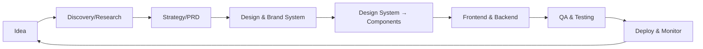
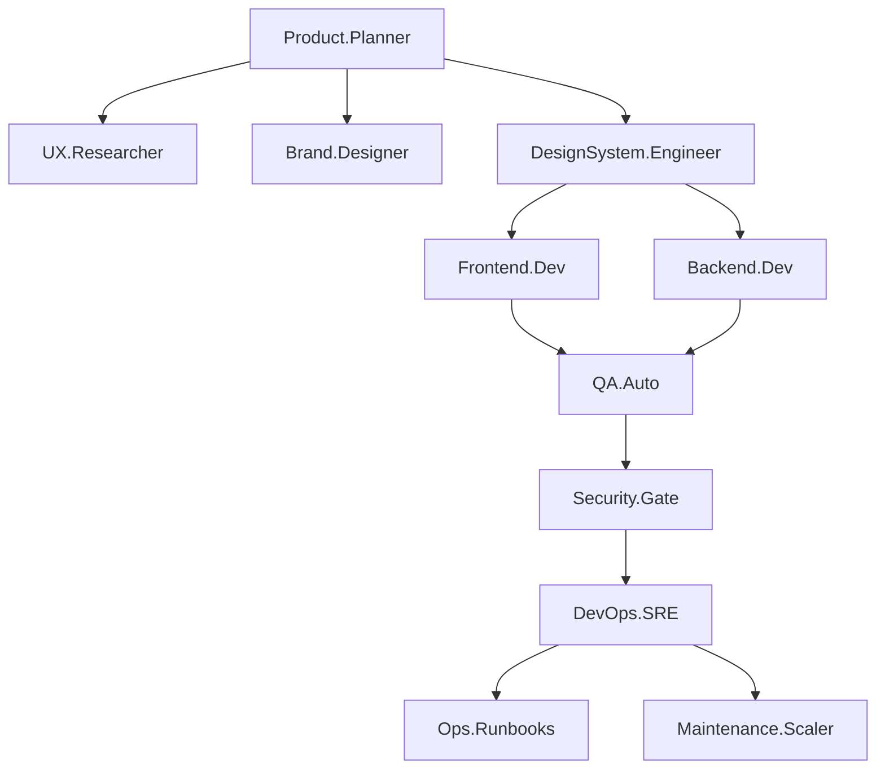

# Enterprise SaaS Lifecycle Blueprint for Gebeta

This document provides a comprehensive overview of the Enterprise SaaS Lifecycle Blueprint implemented for the Gebeta restaurant ordering platform.

---

## Overview

The Enterprise SaaS Lifecycle Blueprint is a complete framework for building, deploying, and maintaining a SaaS product as a solo founder. It simulates an enterprise team structure using SKILLS (Autonomous Behavior Descriptors) that can be invoked by AI agents or followed by humans.

---

## Architecture

### Lifecycle Flow



### SKILLS Hierarchy



---

## SKILLS Directory Structure

```
skills/
├── product-planner/SKILL.md
├── ux-researcher/SKILL.md
├── brand-designer/SKILL.md
├── design-system-engineer/SKILL.md
├── frontend-dev/SKILL.md
├── backend-dev/SKILL.md
├── devops-sre/SKILL.md
├── qa-auto/SKILL.md
├── security-gate/SKILL.md
├── ops-runbooks/SKILL.md
└── maintenance-scaler/SKILL.md
```

### SKILL Summary

| SKILL | Intent | Inputs | Outputs |
|--------|---------|---------|----------|
| Product.Planner | Translate market goals into PRDs | Hypothesis, research, metrics | PRD, backlog, release plan |
| UX.Researcher | Produce personas and journey maps | Interviews, analytics | Personas, journeys, pain points |
| Brand.Designer | Create brand assets and tokens | Brand values, constraints | Brand book, tokens.json |
| DesignSystem.Engineer | Convert tokens to code | tokens.json, Figma | Components, Storybook |
| Frontend.Dev | Implement features | Story spec, API contract | Feature branch, tests |
| Backend.Dev | Implement backend | Data model, events | Migrations, API, realtime |
| DevOps.SRE | Provide IaC and CI/CD | Infra requirements | Terraform, pipelines |
| QA.Auto | Generate and run tests | PR diff, Storybook | Test results, coverage |
| Security.Gate | Run security checks | PR, build artifact | Security report |
| Ops.Runbooks | Create operational docs | Services, SLOs | Runbooks, playbooks |
| Maintenance.Scaler | Provide scaling plans | Metrics, forecast | Scaling playbook |

---

## Documentation Structure

```
docs/
├── README.md                    # Documentation overview
├── prd/                         # Product Requirements Documents
│   └── template.md
├── adr/                         # Architecture Decision Records
│   └── template.md
├── design/                      # Design Documentation
│   ├── template.md
│   ├── tokens-spec.md
│   └── brand-book-template.md
├── api/                         # API Contracts
│   └── template.md
├── ux/                          # UX Rules & Guidelines
│   └── rules.md
├── standards/                   # Coding Standards
│   └── coding.md
├── prompts/                     # AI Prompt Contracts
│   └── frontend-component.md
├── ethiopia/                   # Ethiopia-Specific Considerations
│   └── considerations.md
├── plans/                      # Execution Plans
│   └── 90-day-mvp.md
├── runbooks/                   # Operational Runbooks
│   └── template.md
├── monitoring/                  # SLOs & Monitoring
│   └── slos.md
└── ops/                        # Operations
    └── ci-cd-pipeline.md
```

---

## Key Features

### 1. AI-First Documentation

All documents include YAML front-matter with machine-readable metadata:

```yaml
---
id: document-id
version: 1.0.0
status: draft
owner: owner@example.com
inputs: [input-1, input-2]
outputs: [output-1, output-2]
tests:
  - path: test-path
  - type: test-type
---
```

### 2. SKILL-Based Automation

Each SKILL defines:
- **Intent**: What the SKILL does
- **Inputs**: Required inputs
- **Outputs**: Artifacts produced
- **Constraints**: Rules to follow
- **Acceptance Checks**: Validation criteria

### 3. CI/CD Pipeline with SKILL Gates

The CI/CD pipeline implements automated quality gates:

| Stage | SKILL | Gate Type | Failure Action |
|-------|--------|------------|----------------|
| Lint & Type Check | QA.Auto | Mandatory | Block PR |
| Unit Tests | QA.Auto | Mandatory | Block PR |
| Storybook | DesignSystem.Engineer | Mandatory | Block PR |
| Integration Tests | QA.Auto | Mandatory | Block PR |
| E2E Tests | QA.Auto | Mandatory | Block PR |
| Security Scan | Security.Gate | Mandatory | Block PR |
| Contract Tests | Backend.Dev | Mandatory | Block PR |
| Visual Regression | DesignSystem.Engineer | Warning | Manual Review |
| Build | DevOps.SRE | Mandatory | Block PR |

### 4. Design System & Brand Playbook

- **Token-First Design**: Single source of truth for design decisions
- **Semantic Tokens**: Meaningful names (e.g., `bg-surface-0`, `primary`)
- **Accessibility**: WCAG AA compliance (4.5:1 contrast)
- **Ethiopia Optimization**: Mid-contrast saturation, large tappable targets

### 5. Ethiopia-Specific Considerations

- **Offline-First Architecture**: Core functionality works offline
- **Low-End Device Support**: Optimized for performance
- **Multilingual**: Amharic and English support
- **Cash-First Economy**: Cash payment workflows
- **Local Compliance**: VAT/tax requirements

---

## 90-Day MVP Execution Plan

### Phase 0: Setup & Foundations (Week 0)
- Create repo structure
- Set up CI/CD pipeline
- Create SKILL templates
- Initialize documentation

### Phase 1: Discovery & Design (Weeks 1-3)
- Conduct user research
- Create personas and journey maps
- Design brand system
- Tokenize design

### Phase 2: Build Core MVP (Weeks 3-7)
- Implement backend infrastructure
- Build frontend features
- Integrate design system
- Set up testing

### Phase 3: QA & Field Tests (Weeks 7-10)
- Deploy to pilot merchants
- Run manual scenarios
- Gather metrics
- Fix issues

### Phase 4: Harden & Launch (Weeks 10-12)
- Implement payment/cash flows
- Integrate printing
- Finalize security
- Launch to first batch

---

## Success Metrics

### MVP Goals
- 10 pilot restaurants onboarded
- 200+ orders processed per shift
- KDS latency <= 150ms
- 99% order success rate

### SLOs
- Order Success Rate: 99.5%
- API Availability: 99.9%
- KDS Latency p99: <= 200ms
- Order Creation Latency p99: <= 500ms
- Data Sync Success Rate: 99.0%

---

## Getting Started

### For Solo Founders

1. **Read the Documentation**: Start with `docs/README.md`
2. **Understand SKILLS**: Review each SKILL in `skills/`
3. **Follow the Blueprint**: Use the 90-day MVP plan
4. **Use Templates**: Copy templates from `docs/` for new documents
5. **Implement CI/CD**: Set up the pipeline with SKILL gates

### For AI Agents

1. **Load SKILL**: Load the appropriate SKILL based on the task
2. **Follow Contract**: Use the prompt contracts in `docs/prompts/`
3. **Generate Artifacts**: Produce the required outputs
4. **Validate Checks**: Ensure all acceptance checks pass
5. **Update Documentation**: Keep docs in sync with changes

---

## Best Practices

### Do's
- Use design tokens exclusively
- Write tests for all code
- Document decisions in ADRs
- Follow coding standards
- Keep PRs small and focused
- Update documentation with changes

### Don'ts
- Hard-code colors or values
- Skip tests
- Make large monolithic PRs
- Mix business logic into components
- Ignore accessibility
- Skip documentation updates

---

## Anti-Patterns

1. **Dribbble-Clone Syndrome**: Borrowing designs without rationale
2. **Direct Style Editing**: Bypassing the design system
3. **Large Monolithic PRs**: Hard to review and test
4. **Visual-Only Acceptance**: No tests or tokens
5. **Unversioned Event Schemas**: Breaking changes without versioning

---

## Related Resources

- [Anthropic Skills](https://github.com/anthropics/skills)
- [Claude Blog: Equipping Agents for the Real World](https://claude.com/blog/equipping-agents-for-the-real-world-with-agent-skills)
- [Design Tokens Community Format](https://tr.designtokens.org/format/)
- [WCAG 2.1 Guidelines](https://www.w3.org/WAI/WCAG21/quickref/)

---

## License

This blueprint is provided as-is for use in building the Gebeta restaurant ordering SaaS platform.

---

## Changelog

### 1.0.0 (2025-02-02)
- Initial Enterprise SaaS Lifecycle Blueprint
- 11 SKILLS defined
- Complete documentation structure
- 90-day MVP execution plan
- CI/CD pipeline with SKILL gates
- Ethiopia-specific considerations